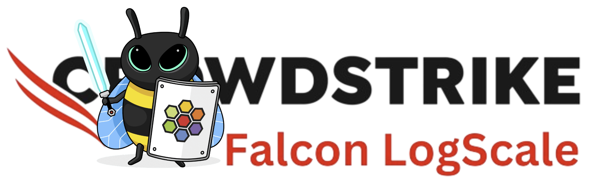
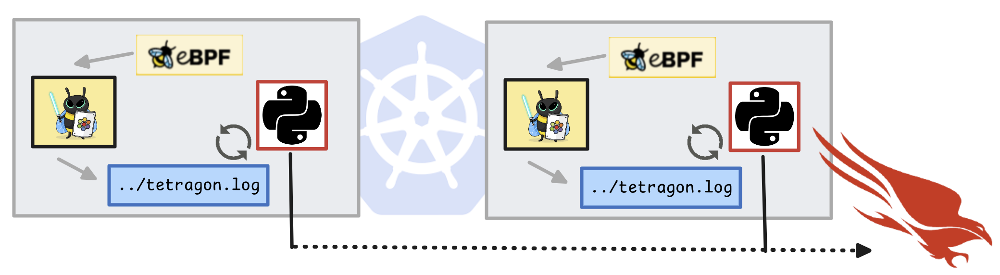
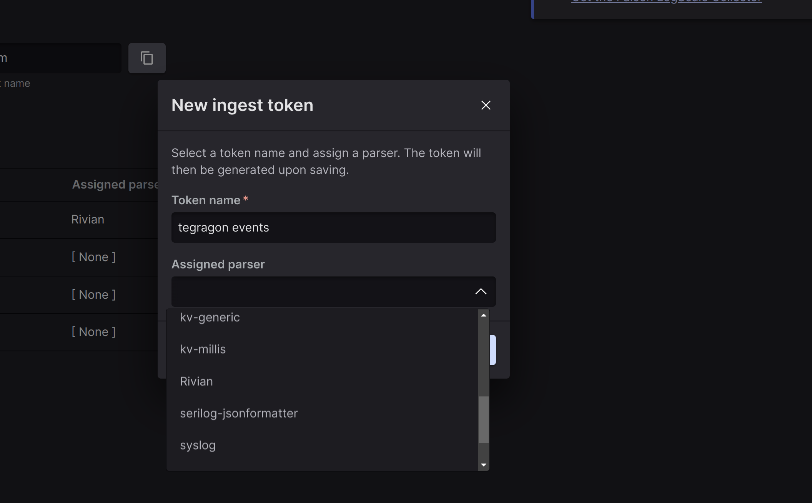
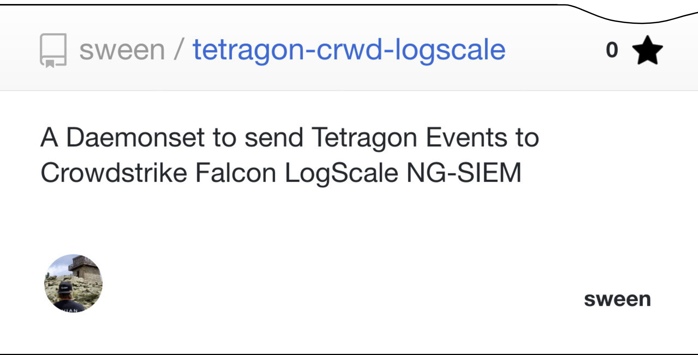
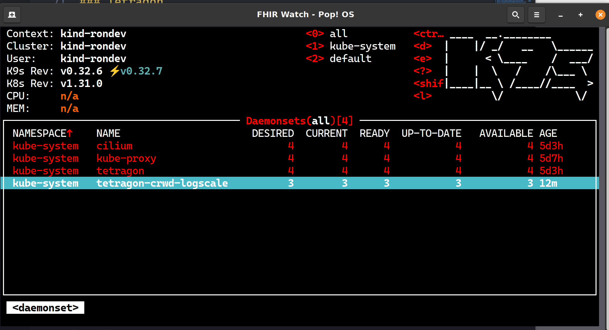
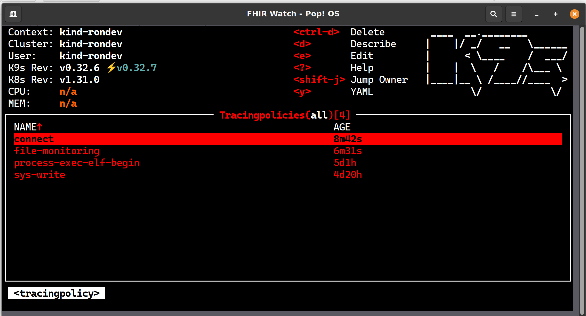
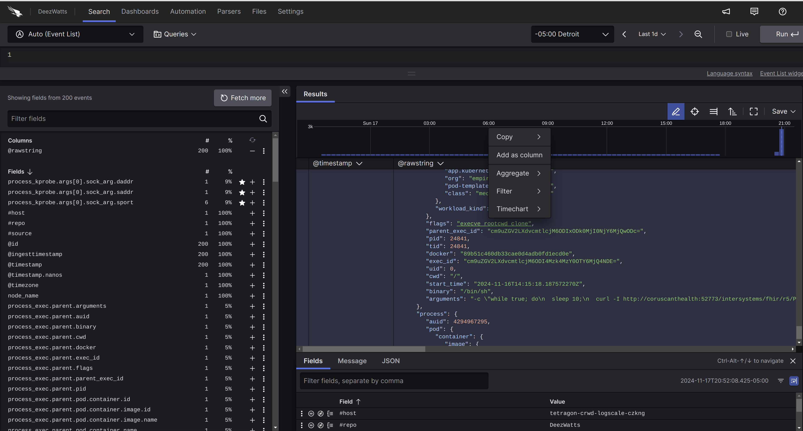
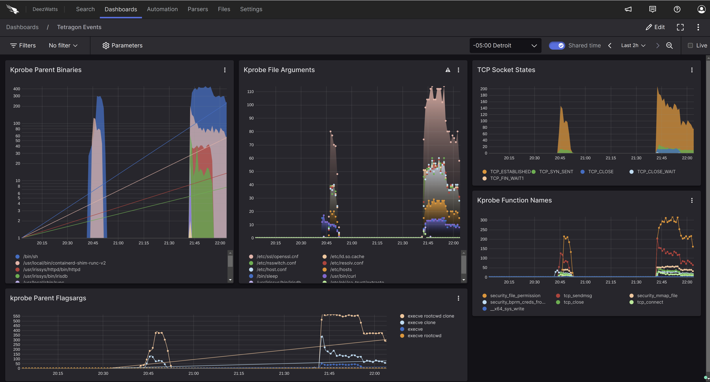
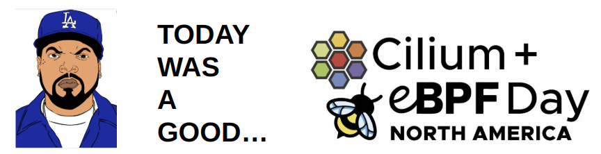

A DaemonSet to tail and push [Tetragon (OSS)](https://tetragon.io/) Events to [CrowdStrike Logscale Community (SIEM)](https://library.humio.com/integrations/api-ingest.html) ingestion endpoint. The solution is dead simple, powered by a standard Kubernetes Daemonset that schedules on the same nodes as Tetragon, and tails the `tetragon.log` that is available via hostPath, and sends each event with a simple [python script]() using the [Humio Library]() to Crowdstrike, employing a parser bound to the api key to build *clown suits* and *triggers* for events.

## Inspiration

At KubeCon, I spent Tuesday at eBPF/Cilium Day, and was looking for that thinger to come to mind where I can tangibly put something together what I saw if my brain would afford it... and had that moment that lead to an early exit after the session [eBPF for Creating Least Privileged Policies; What Do I Need to Know to Prepare for the Next CVEs? - Natália Réka Ivánkó & John Fastabend](https://colocatedeventsna2024.sched.com/event/1izqD/ebpf-for-creating-least-privileged-policies-what-do-i-need-to-know-to-prepare-for-the-next-cves-natalia-reka-ivanko-isovalent-now-part-of-cisco).  The message in the session was zero trust baselines using Tetragon to figure it out, I gravitated to the integration with Splunk and bent it a way I have done before (slightly) with my [Truck](https://www.deezwatts.com/workloads/rivian-falcon-logscale) and prevelant [IRIS Workload](https://community.intersystems.com/post/iris-siem-system-integration-crowdstrike-logscale) I support with [CrowdStrike Logscale Community (SIEM)](https://library.humio.com/integrations/api-ingest.html).

## Overview 
You have a Kubernetes Cluster protected with install [Tetragon](https://tetragon.io/), and you want to send those events to a install [CrowdStrike Logscale Community (SIEM)](https://library.humio.com/integrations/api-ingest.html) for observability of those events.



Project Page: https://sween.github.io/tetragon-crwd-logscale/

## Quick Install
The 1, 2, 3, 4 to get up and running.

### API Key/Secret
Create an api-key in the Crowdstrike console, assign a [parser]() to it, and load it up in a Secret for the Daemonset to utilize.  Parsers are necessary in production for speed and normalization, but for general inspection here, we will use a general parser.  Binding a parser to an endpoint is an important concept to understand.




Shhhhhhh.... load the api key up as a Secret.

```
kubectl create secret generic cs-logscale-apikey -n kube-system     --from-literal=apikey="....-30c2-48a5-b986-....."
```

### Install This
Install this [DaemonSet](https://sween.github.io/tetragon-crwd-logscale/)



```
kubectl apply -f https://raw.githubusercontent.com/sween/tetragon-crwd-logscale/refs/heads/main/chart/tetragon-crwd-logscale/templates/tetragon-crwd-logscale-daemonset.yaml
```



### Ensure Tracing Policies
Of course, make sure Tetragon is loaded up with some Tracing Policies, there are four or so in the repo that get the point across.



### Inspect Events
See if you have a new events in the Search Console, and get exploring!




### Build a Dashboard
Now, put a Clown Suit on those events!  Your context menu in the search console is your cheat code, you can basically snag any field from anywhere, and use it as a timeseries value and it will generate a time series visualization.

Give it awhile to draw you a picture of what the active workloads on the cluster are up to, and build a baseline.



Mission Accomplished, and today was a good Cilium/eBPF Day!  

What a fantastic community these Isovalent peeps are.




## Do It Yourself Demo
To be performed in the style of an [Isovalent Lab](https://labs-map.isovalent.com/)! The following will allow you to get up and running quickly while installing it the dependant infrastructure soup to nuts as they say.

### Kind Cluster
Quick Kubernetes Cluster, 3 worker nodes wide.

```
cat <<EOF | kind create cluster -n tetralogscale --config=-
kind: Cluster
apiVersion: kind.x-k8s.io/v1alpha4
nodes:
  - role: control-plane
  - role: worker
  - role: worker
  - role: worker
networking:
  disableDefaultCNI: true
EOF
```

### Cilium
If for nothing else, install [Cilium](https://cilium.io/) as a CNI of bad assery.

```
cilium install version 1.16.2
```

### Tetragon
Defaults should get it done with install [Tetragon](https://tetragon.io/), the star of our show.

```
EXTRA_HELM_FLAGS=(--set tetragon.hostProcPath=/proc) # flags for helm install
helm repo add cilium https://helm.cilium.io
helm repo update
helm install tetragon ${EXTRA_HELM_FLAGS[@]} cilium/tetragon -n kube-system
kubectl rollout status -n kube-system ds/tetragon -w
```

### Tracing Policies
Load up Tetragon with some tracingpolicies to get some events flowing.  

```
kubectl apply -f https://raw.githubusercontent.com/sween/tetragon-crwd-logscale/refs/heads/main/tracingpolicies/*

kubectl apply -f https://raw.githubusercontent.com/sween/tetragon-crwd-logscale/refs/heads/main/tracingpolicies/tetragon-crwd-logscale-daemonset.yaml

kubectl apply -f https://raw.githubusercontent.com/sween/tetragon-crwd-logscale/refs/heads/main/tracingpolicies/process-exec-elf-begin.yaml

kubectl apply -f https://raw.githubusercontent.com/sween/tetragon-crwd-logscale/refs/heads/main/tracingpolicies/filename_monitoring.yaml

```


### Crowdstrike LogScale Community

Getting Started was ridiculously straight forward and I had the account approved in a couple of days with the following disclaimer:

_Falcon LogScale Community is a free service providing you with up to 16 GB/day of data ingest, up to 5 users, and 7 day data retention, if you exceed the limitations, you’ll be asked to upgrade to a paid offering. You can use Falcon LogScale under the limitations as long as you want, provided, that we can modify or terminate the Community program at any time without notice or liability of any kind._

Pretty generous and a good fit for this implementation, with the caveat all good things can come to an end I guess... be warned Kernel events are chatty, so 16GB may brush up against this limit.


###
Apply a Workload, my [FHIR® based/Star Wars](https://community.intersystems.com/post/ebpf-cilium-fhir%C2%AE-star-wars-story) version.

```
kubectl apply -f https://raw.githubusercontent.com/sween/basenube/refs/heads/main/scenarios/ciliumfhir/deploy/cilium-intersystems-fhir-starwars.yaml
```

### Build a Dashboard


## About the Container
If you want some info on the container running in the daemonset, it is for your inspection/availability out on dockerhub.

Docker Image [Dockerfile]() is available for public review on [DockerHub]() for the curious, I also wanted to figure out the BOM for this guy, as I lazilly created it from Ubuntu, installed the [Humio Client (LogScale)]().

You can install the [CrowdStrike Operator](https://github.com/CrowdStrike/falcon-operator/blob/main/docs/deployment/generic/README.md) for Kubernetes and see what it says about your container security as well with a subscription.

To Build the container yourself if you dont like what you see...

```
docker build -t tetragon-crwd-logscale .
docker image tag tetragon-crwd-logscale sween/tetragon-crwd-logscale:latest
docker push sween/tetragon-crwd-logscale:latest # push wherever
```

## Author

Ron Sweeney [sween](https://www.github.com/sween)


